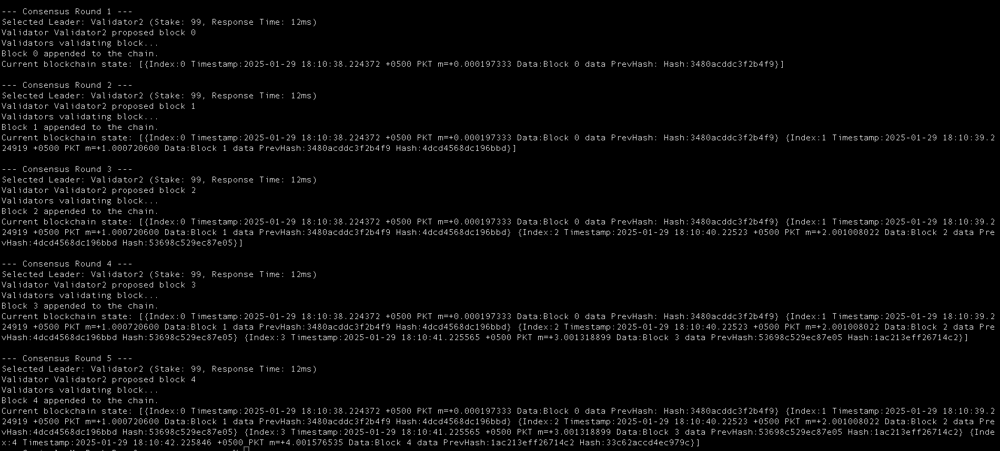

# **Problem**

Simplified Proof-of-Stake (PoS) consensus algorithm using Golang. The algorithm
should:

* Accept multiple validator nodes.
* Assign each node a stake.
* Randomly select a leader based on stake amount and time.
* Propose a block and get it validated by the other nodes.
* Ensure the consensus is reached
* Update the state of the chain by appending the block.

You can use simple structures to represent blocks and validators. Ensure the code is modular
and uses appropriate Go concurrency patterns.

# **Output**

**--- Consensus Round 1 ---**

Selected Leader: Validator2 (Stake: 99, Response Time: 12ms)

Validator Validator2 proposed block 0

Validators validating block... 

Block 0 appended to the chain.

`Current blockchain state: [{Index:0 Timestamp:2025-01-29 18:10:38.224372 +0500 PKT m=+0.000197333 Data:Block 0 data PrevHash: Hash:3480acddc3f2b4f9}]
`

**--- Consensus Round 2 ---**

Selected Leader: Validator2 (Stake: 99, Response Time: 12ms)

Validator Validator2 proposed block 1

Validators validating block...

Block 1 appended to the chain.

`Current blockchain state: [{Index:0 Timestamp:2025-01-29 18:10:38.224372 +0500 PKT m=+0.000197333 Data:Block 0 data PrevHash: Hash:3480acddc3f2b4f9} {Index:1 Timestamp:2025-01-29 18:10:39.224919 +0500 PKT m=+1.000720600 Data:Block 1 data PrevHash:3480acddc3f2b4f9 Hash:4dcd4568dc196bbd}]
`

**--- Consensus Round 3 ---**

Selected Leader: Validator2 (Stake: 99, Response Time: 12ms)

Validator Validator2 proposed block 2

Validators validating block...

Block 2 appended to the chain.

`Current blockchain state: [{Index:0 Timestamp:2025-01-29 18:10:38.224372 +0500 PKT m=+0.000197333 Data:Block 0 data PrevHash: Hash:3480acddc3f2b4f9} {Index:1 Timestamp:2025-01-29 18:10:39.224919 +0500 PKT m=+1.000720600 Data:Block 1 data PrevHash:3480acddc3f2b4f9 Hash:4dcd4568dc196bbd} {Index:2 Timestamp:2025-01-29 18:10:40.22523 +0500 PKT m=+2.001008022 Data:Block 2 data PrevHash:4dcd4568dc196bbd Hash:53698c529ec87e05}]
`

**--- Consensus Round 4 ---**

Selected Leader: Validator2 (Stake: 99, Response Time: 12ms)

Validator Validator2 proposed block 3

Validators validating block...

Block 3 appended to the chain.

`Current blockchain state: [{Index:0 Timestamp:2025-01-29 18:10:38.224372 +0500 PKT m=+0.000197333 Data:Block 0 data PrevHash: Hash:3480acddc3f2b4f9} {Index:1 Timestamp:2025-01-29 18:10:39.224919 +0500 PKT m=+1.000720600 Data:Block 1 data PrevHash:3480acddc3f2b4f9 Hash:4dcd4568dc196bbd} {Index:2 Timestamp:2025-01-29 18:10:40.22523 +0500 PKT m=+2.001008022 Data:Block 2 data PrevHash:4dcd4568dc196bbd Hash:53698c529ec87e05} {Index:3 Timestamp:2025-01-29 18:10:41.225565 +0500 PKT m=+3.001318899 Data:Block 3 data PrevHash:53698c529ec87e05 Hash:1ac213eff26714c2}]
`

**--- Consensus Round 5 ---**

Selected Leader: Validator2 (Stake: 99, Response Time: 12ms)

Validator Validator2 proposed block 4

Validators validating block...

Block 4 appended to the chain.

`Current blockchain state: [{Index:0 Timestamp:2025-01-29 18:10:38.224372 +0500 PKT m=+0.000197333 Data:Block 0 data PrevHash: Hash:3480acddc3f2b4f9} {Index:1 Timestamp:2025-01-29 18:10:39.224919 +0500 PKT m=+1.000720600 Data:Block 1 data PrevHash:3480acddc3f2b4f9 Hash:4dcd4568dc196bbd} {Index:2 Timestamp:2025-01-29 18:10:40.22523 +0500 PKT m=+2.001008022 Data:Block 2 data PrevHash:4dcd4568dc196bbd Hash:53698c529ec87e05} {Index:3 Timestamp:2025-01-29 18:10:41.225565 +0500 PKT m=+3.001318899 Data:Block 3 data PrevHash:53698c529ec87e05 Hash:1ac213eff26714c2} {Index:4 Timestamp:2025-01-29 18:10:42.225846 +0500 PKT m=+4.001576535 Data:Block 4 data PrevHash:1ac213eff26714c2 Hash:33c62accd4ec979c}]`

